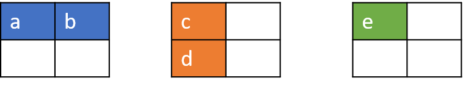
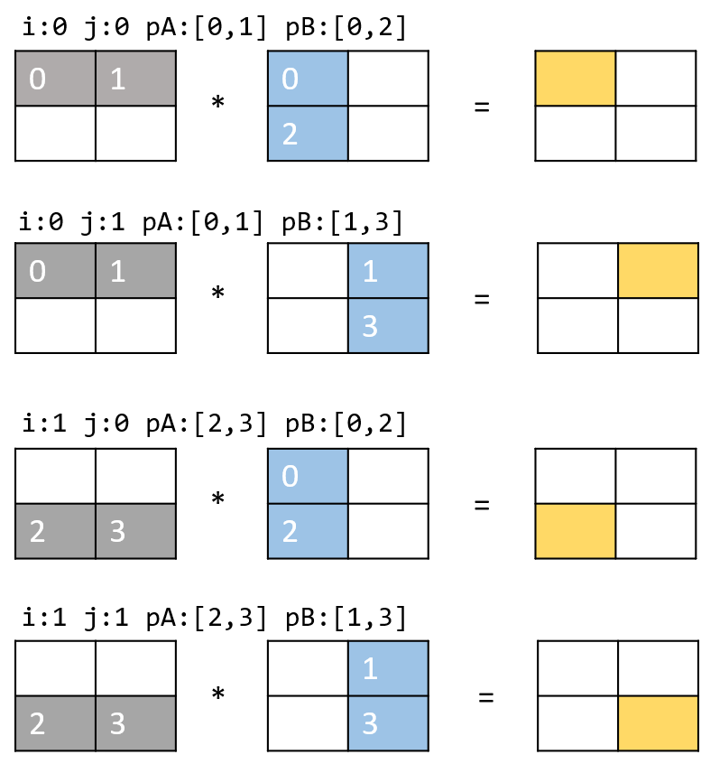
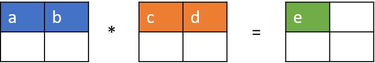
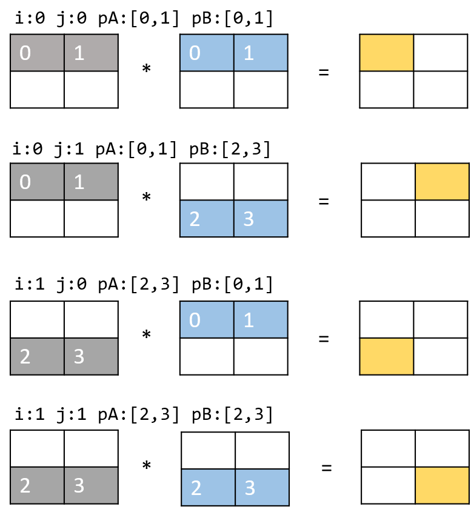
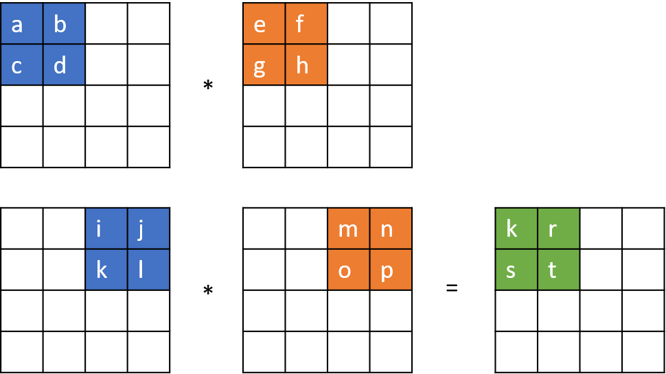
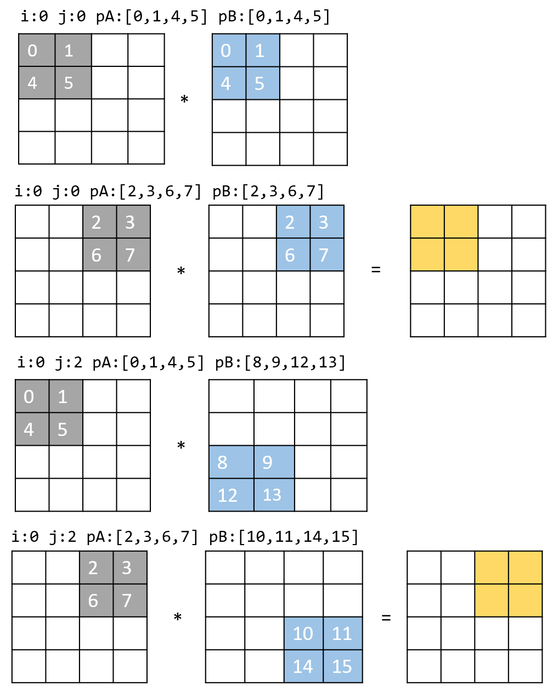

# Algoritmos
Todos los algoritmos descritos hacen uso de apuntadores para operar sobre los valores de las matrices. La principal diferencia radica en la implementación de estos que varía según el algoritmo. En general se tienen tres ciclos for para operar las matrices.

Se hacen uso de directivas de OpenMP como `omp pragma parallel`, `pragma omp for` y `pragma omp master`. Donde se define un equipo de hilos, se indica la paralelización de un bucle for y se especifica el desarrollo de una actividad únicamente por el hilo maestro.

```c
for (i = 0; i < SZ; i++) // Filas de A
    for (j = 0; j < SZ; j++) { // Columnas de B 
        ...
            for (k = SZ; k > 0; k--, ...) // Elementos de A/B
                S += ...
        c[i * SZ + j] = S;
    }
```
Las matrices que operan estos algoritmos deben ser cuadradas.

## algorithm_1
Este script realiza la multiplicación de matrices convencional entre filas por columnas. El movimiento entre columnas se realiza aumentado el apuntador de la matriz B en el tamaño de la matriz `SZ`. 
```c
for (k = SZ; k > 0; k--, pA++, pB += SZ)
```
En términos simples `e = a*c + b*d`. Para una descripción más completa puede remitirse [al código fuente](../algorithm_1.c).



El algoritmo por lo tanto desarrolla:



## algorithm_2
Este script realiza la multiplicación de matrices entre filas por filas. A diferencia del algoritmo anterior, el apuntador ahora será igual a `pA`. 
```c
for (k = SZ; k > 0; k--, pA++, pB ++)
```


Donde `e = a*c + b*d`. Para una descripción más completa puede remitirse [al código fuente](../algorithm_2.c).

El algoritmo ejecuta:



## algorithm_3
Este script realiza la multiplicación de matrices entre dos filas por dos filas. Los apuntadores ahora se mueven de 2 en 2, tanto `pA` como `pB`. 
```c
for (k = SZ; k > 0; k--, pA+=2, pB +=2)
```


Donde:
```
k = (a*e + b*f) + (i*m + j*n)
r = (a*g + b*h) + (i*o + j*p)
s = (c*e + d*f) + (k*m + l*n)
t = (c*g + d*h) + (k*o + l*p)
```
Para una descripción más completa puede remitirse [al código fuente](../algorithm_3.c).

El algoritmo ejecuta:




